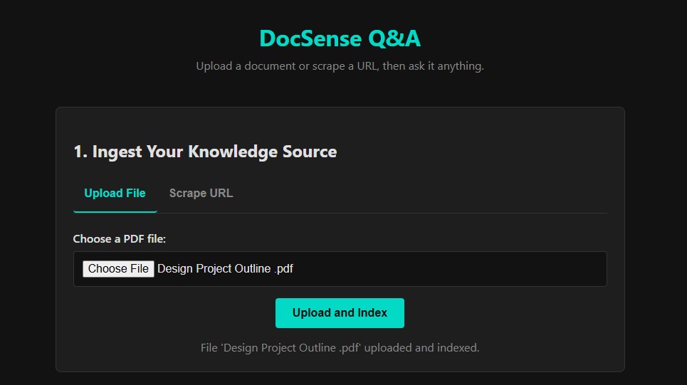

# DocSense: A High-Fidelity RAG Q&A System



## 🚀 Introduction

DocSense is a full-stack **Retrieval-Augmented Generation (RAG)** system built to provide accurate, verifiable answers from private knowledge sources. This project tackles the core "hallucination" problem of large language models by grounding them in specific, user-provided context.

Unlike a simple chatbot, DocSense does not rely on its pre-trained knowledge. Instead, it dynamically builds a knowledge base from uploaded PDF documents or scraped web content. It then uses a sophisticated pipeline to retrieve relevant information and generate answers that are backed by real sources, complete with citations.

This application demonstrates an end-to-end understanding of modern AI application development, from robust data ingestion to a dynamic, user-friendly frontend.

## ✨ Key Features

*   **Advanced PDF Parsing:** Utilizes the `PyMuPDF` library to intelligently extract clean, readable text even from complex, multi-column research papers, avoiding the "garbage in, garbage out" problem.
*   **Dual Ingestion Methods:** Users can build a knowledge base by either uploading local PDF files or scraping live content directly from a URL.
*   **Real-Time Streaming Responses:** Answers are streamed back to the user token-by-token, providing a modern, "ChatGPT-like" interactive experience.
*   **Verifiable Source Citations:** Every answer is accompanied by the exact text snippets from the source document that were used to generate it, ensuring trust and accuracy.
*   **Modern Tech Stack:** Built with a fully asynchronous Python backend using FastAPI and powered by Google's powerful Gemini family of models.
*   **Interactive Frontend:** A sleek, single-page application with a tabbed interface for easy document ingestion and a real-time chat window for Q&A.

## 🛠️ Tech Stack

| Category | Technology |
| :--- | :--- |
| **Backend** | Python, FastAPI, Uvicorn |
| **AI / RAG Pipeline** | LlamaIndex, Google Gemini API (`gemini-flash-latest`, `embedding-001`) |
| **Data Parsing** | PyMuPDF (for PDFs), BeautifulSoup (for HTML) |
| **Frontend** | HTML5, CSS3, Vanilla JavaScript |
| **Core Libraries** | Pydantic, python-dotenv, asyncio |

## 🏗️ System Architecture

The application follows a standard RAG pipeline, divided into two main flows:

1.  **Ingestion Flow:**
    *   The user provides a source (PDF or URL) via the frontend.
    *   The FastAPI backend receives the source.
    *   **If PDF:** `PyMuPDF` cleanly parses the text content.
    *   **If URL:** `Requests` & `BeautifulSoup` scrape and clean the HTML content.
    *   `LlamaIndex` chunks the clean text and uses the `GeminiEmbedding` model to create vector embeddings.
    *   A `VectorStoreIndex` is created and stored in memory for querying.

2.  **Query Flow:**
    *   The user asks a question in the chat interface.
    *   The backend creates a vector embedding of the question.
    *   `LlamaIndex` performs a similarity search on the vector index to find the most relevant text chunks (the "context").
    *   The original question and the retrieved context are passed to the `Gemini` LLM in a carefully crafted prompt.
    *   The LLM generates an answer based *only* on the provided context, which is streamed back to the user token-by-token.
    *   The source text chunks are sent to the frontend as citations.

## ⚙️ Getting Started

Follow these instructions to get a local copy up and running.

### Prerequisites

*   Python 3.10+
*   A Google Gemini API Key

### Installation & Setup

1.  **Clone the repository:**
    ```bash
    git clone https://github.com/your-username/your-repo-name.git
    cd your-repo-name
    ```

2.  **Create and activate a virtual environment:**
    ```bash
    # For Mac/Linux
    python3 -m venv venv
    source venv/bin/activate

    # For Windows
    python -m venv venv
    venv\Scripts\activate
    ```

3.  **Install the dependencies:**
    ```bash
    pip install -r requirements.txt
    ```

4.  **Set up your environment variables:**
    *   Create a new file named `.env` in the root of the project.
    *   Add your Google API key to it:
        ```env
        GOOGLE_API_KEY="your-secret-api-key-here"
        ```

5.  **Run the application:**
    ```bash
    uvicorn main:app --reload
    ```

6.  **Open your browser** and navigate to `http://127.0.0.1:8000`.

## 🔮 Future Improvements

This project serves as a strong foundation. Potential next steps include:

*   **Persistent Storage:** Implementing a vector database like FAISS, ChromaDB, or Pinecone to save and load indexes, so documents don't need to be re-indexed on every server restart.
*   **Dockerization:** Containerizing the application with Docker and Docker Compose for easy, reproducible deployments.
*   **Multi-Document Support:** Allowing users to build a knowledge base from multiple documents simultaneously.
*   **Advanced RAG Techniques:** Integrating a reranker model to improve the quality of retrieved context before it's sent to the LLM.

## 📄 License

Distributed under the MIT License. See `LICENSE` for more information.